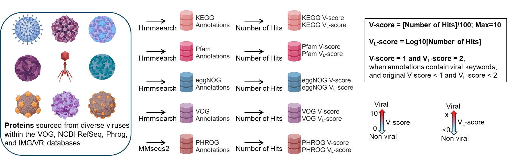
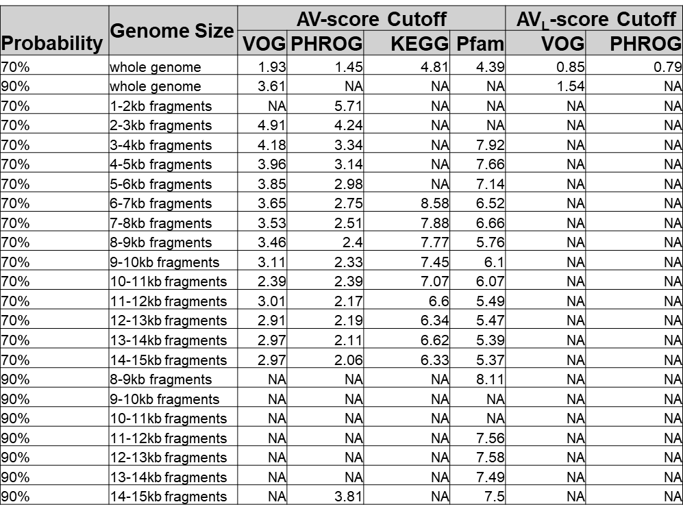

# V-Score-Search

V-Score-Search is an online-search website for the public to search V-scores and VL-scores associated with every protein cluster or family in five widely used public databases including PHROG, VOG, KEGG, Pfam, and eggNOG. V-scores and VL-scores are quantitative metrics to serve as a virus-like signature for differentiating between viral and non-viral protein families and genomes (Fig. 1). We demonstrate specific use cases of V-scores and VL-scores in virus identification, prophage discovery, annotation of host-derived and metabolic proteins on viral genomes, and virus genome binning. V-scores and VL-scores can serve as a metric to define the likelihood of protein families being detected in viruses and enable diverse applications associated with viral genomics, ecology, and evolution.
For more detail on V-scores and VL-scores and how they work, please see our paper (https://www.biorxiv.org/content/10.1101/2024.10.24.619987v1).

  

### Fig. 1| Concepts of V-score and VL-score. 
Workflow of V-score and VL-score generation. Nine representatives of viral taxa are shown here for the diverse viruses used in the study.  A scale for V-scores and VL-scores is displayed by two-sided arrows going from 0 to 10 and <0 to X, respectively, suggesting low scores indicate non-viral and high-scores indicate viral.

## Getting Started: Determine the probability that a genome sequence is viral

### Recommended steps before searching: 

1.	Identify and translate open reading frames in genomes using pyrodigal-gv[1, 2] (github.com/althonos/pyrodigal-gv).  
2.	Align translated proteins to Pfam-A[3] HMMs, VOG HMMs, and KEGG[4] KO HMMs using pyhmmer[5, 6] hmmsearch[5] with a maximum e-value of 1e-05.
3.	Employ MMseqs2 (parameter: E-value ≤ 10-5) to search the proteins against the PHROG database. Only keep the hit with the highest score.
  VOG: Virus Orthologous Groups database (https://fileshare.csb.univie.ac.at/vog/)
  PHROG: Prokaryotic Virus Remote Homologous Groups database (https://phrogs.lmge.uca.fr/)
  KEGG: Kyoto Encyclopedia of Genes and Genomes (https://www.genome.jp/kegg/)
  Pfam: a large collection of protein families (http://pfam-legacy.xfam.org/)

### Search and assign scores: 

1.	Search annotations on V-Score-Search (https://anantharamanlab.github.io/V-Score-Search/)
2.	Assign V-score and VL-score of KEGG, VOG, Pfam, and PHROG to each protein.
3.	Calculate average V-score and VL-score (AV-score and AVL-score) for each genome. The AV-score and AVL-score of KEGG and Pfam are expressed as:
      AV-score = (Sum of V-score of Proteins with Significant Hits) / (Number of Proteins with Significant Hits);
      AVL-score = (Sum of VL-score of Proteins with Significant Hits) / (Number of Proteins with Significant Hits).
4.	Calculate average V-score and VL-score (AV-score and AVL-score) for each genome. The AV-score and AVL-score of PHROG and VOG are expressed as:
      AV-score = (Sum of V-score of Proteins with Significant Hits) / (Total Number of Proteins Encoded in A Genome);
      AVL-score = (Sum of VL-score of Proteins with Significant Hits) / (Total Number of Proteins Encoded in A Genome).

### Explanation for scores: 

See probability formulae for determining whether a genome is viral in our paper (https://www.biorxiv.org/content/10.1101/2024.10.24.619987v1).

Here we provide a summary table of the probability of genome being viral across different sequence sizes as below:

### Table 1 Probability of being viral genomes across different sequence sizes.

  

Predicted viral genomes were identified based on the following criteria: (1) sequences with at least one AV-score (from VOG, PHROG, KEGG, or Pfam) exceeding the corresponding cutoffs for each fragment size (e.g., a PHROG AV-score > 4.24 or a VOG AV-score > 4.91 for a 2.5 kb scaffold; detailed cutoffs by fragment size are provided in Table 1). For sequences larger than 15 kb, cutoffs for 14−15 kb fragments were used. (2) Sequences meeting criterion (1) were further filtered for completeness >0%, as assessed by CheckV[7] v1.0.13.

## Contact
Please contact Karthik Anantharaman (karthik@bact.wisc.edu or GitHub Issues) with any questions, concerns or comments.
Thank you for using V-score-search!

## Copyright 
V-score-search:  Copyright (C) 2024 Kun Zhou, James Kosmopoulos, Etan Dieppa, Peter Badciong, Karthik Anantharaman
This program is free software: you can redistribute it and/or modify it under the terms of the GNU General Public License as published by the Free Software Foundation, either version 3 of the License, or (at your option) any later version.
This program is distributed in the hope that it will be useful, but WITHOUT ANY WARRANTY; without even the implied warranty of MERCHANTABILITY or FITNESS FOR A PARTICULAR PURPOSE. See the GNU General Public License for more details.
GNU General Public License as published by the Free Software Foundation, either version 3 of the License, or (at your option) any later version.

## References
1.	Camargo AP, Roux S, Schulz F et al. Identification of mobile genetic elements with genomad. Nat Biotechnol. 2023;42:1303-12 https://doi.org/10.1038/s41587-023-01953-y
2.	Hyatt D, Chen GL, Locascio PF et al. Prodigal: Prokaryotic gene recognition and translation initiation site identification. BMC Bioinf. 2010;11:1-11 https://doi.org/10.1186/1471-2105-11-119
3.	Mistry J, Chuguransky S, Williams L et al. Pfam: The protein families database in 2021. Nucleic Acids Res. 2021;49:D412-D19 https://doi.org/10.1093/nar/gkaa913
4.	Kanehisa M, Sato Y, Kawashima M et al. Kegg as a reference resource for gene and protein annotation. Nucleic Acids Res. 2016;44:D457-D62
5.	Eddy SR. Accelerated profile hmm searches. PLoS Comput Biol. 2011;7:e1002195
6.	Larralde M, Zeller G. Pyhmmer: A python library binding to hmmer for efficient sequence analysis. Bioinformatics. 2023;39:btad214
7.	Nayfach S, Camargo AP, Schulz F et al. Checkv assesses the quality and completeness of metagenome-assembled viral genomes. Nat Biotechnol. 2020;39:578-85 https://doi.org/10.1038/s41587-020-00774-7

